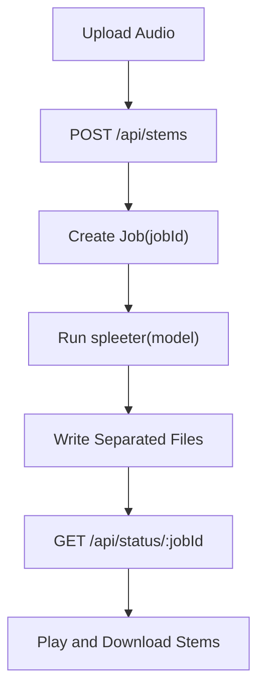

# PrismTrack

这是一个基于 Spleeter 的音乐分轨 Web 应用。用户上传音频后，后端调用 `spleeter` 将音频分离为人声、鼓组、贝斯、钢琴和其他轨道，前端提供进度展示、在线试听、音量控制和分轨下载。

## 功能

- 上传常见音频文件（`mp3`、`wav`、`m4a`、`ogg`、`flac`）
- 选择 Spleeter 模型（`spleeter:2stems`、`spleeter:4stems`、`spleeter:5stems`）
- 后端异步分轨并提供任务状态查询
- 前端支持单轨播放、全轨播放、静音、音量调节
- 支持下载单个音轨或全部音轨压缩包
- 自动清理过期任务产物（默认 1 小时）

## 技术栈

- 后端：Node.js 原生 `http` 服务（`server.js`）
- 前端：原生 HTML/CSS/JavaScript（`index.html`、`styles.css`、`src/main.js`）
- 音频分离：Python 工具 `spleeter`（通过子进程调用）

## 快速开始

```bash
# 安装 Node.js 依赖
npm install

# 启动服务
npm start
```

启动后访问：`http://127.0.0.1:8000/`

## 运行依赖

后端依赖系统可执行命令 `spleeter`。若未安装，可使用：

```bash
# 全局安装 Spleeter
pip install --break-system-packages spleeter
```

也可以通过环境变量指定 Spleeter 可执行路径：

```bash
# 使用自定义 spleeter 路径
SPLEETER=/path/to/spleeter npm start
```

## API 概览

- `GET /api/health`：检查 Spleeter 可用性
- `GET /api/models`：获取可选模型列表
- `POST /api/stems`：上传音频并创建分轨任务
- `GET /api/status/:jobId`：查询任务状态与结果
- `GET /api/download/:jobId/:stem`：下载音轨，`:stem` 支持 `vocals`、`drums`、`bass`、`other`、`all`

## 处理流程

1. 前端将音频文件和模型参数通过 `multipart/form-data` 提交到 `/api/stems`。
2. 后端写入临时上传目录，创建任务并异步执行 Spleeter。
3. 前端轮询 `/api/status/:jobId` 获取进度与输出结果。
4. 任务完成后，前端加载分轨音频用于试听和下载。
5. 到达清理时间后，后端自动删除临时输入和分轨输出。



## 目录结构

- `server.js`：API、任务编排、静态文件服务、压缩下载
- `src/main.js`：上传交互、状态轮询、音轨播放器控制
- `index.html`：页面结构
- `styles.css`：页面样式
- `.runtime/uploads`：上传临时目录（运行时生成）
- `.runtime/prismtrack-stems`：Spleeter 输出目录（运行时生成）

## 备注

- 若 `spleeter` 不可用，`/api/health` 会返回错误信息，页面会提示服务不可用。
